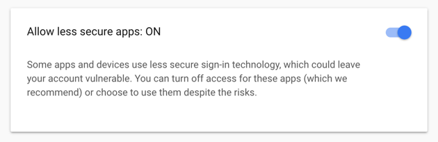

# FAQ

### How to parse EML files?

What if you have your emails stored in EML files? Not a problem! Use `EMLParser.create().parse()`. It accepts both file or files content as an input and returns `ReceivedEmail` of parsed EML message.

### Gmail and new messages count?

Gmail does not support the Recent flags on messages. Since the `getNewMessageCount()` method counts messages with the RECENT flags, _Jodd_ will not \(yet\) find any such messages on Gmail servers \(hence always returning value 0\).

### Can't access Gmail?

Getting the following exception when accessing Gmail:

```text
[ALERT] Please log in via your web browser:
```

Allow access for less secured apps:



### How to parse and validate an email address?

We use `RFC2822AddressParser` class to parse, clean up, and extract email addresses parsing email addresses per **RFC2822** syntax. It can be trusted to only provide authenticated results. This class has been successfully used on many billion real-world addresses, live in production environments, but it's not perfect yet, since the standard is quite complex. Unlike `InternetAddress`, this class will preserve any RFC-2047-encoding of international characters.

### I am getting an exception when receiving emails?

It may happen that email receiving fails if you have different java-mail libraries on your classpath. For example, on Apache CXF there is `geronimo-javamail_1.4_spec-1.7.1.jar` and it conflicts with the _Jodd_ _Email_.

### Is embed attachment always supposed to be inline?

Here is how we see it:

* `inline` and `content-ID` can be set separately.
* embedded images should be set using `Content-Disposition`. Of course, setting `content-ID` is required if you want to use them.
* we could not find any reference of `inline` without a `content-ID`.

The answer is Yes - embedded attachment sets both `content-ID` and `inline`.

